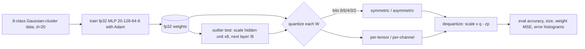

# AI Learn 21 — Quantization from Scratch (NumPy)

Train a small MLP in fp32, then apply **post-training weight quantization** by hand: int8 down to int2, **symmetric vs asymmetric**, and **per-tensor vs per-channel** scales. Measure accuracy vs bits, model size, and quantization error, and run an "outlier channel" test that shows why per-channel scales matter.

Everything is NumPy with manual backprop and a hand-written Adam. There is no autograd and no network access.

## What you'll learn

- The quantize/dequantize math: `q = clip(round(w/scale) + zp)`, `w_hat = scale·(q − zp)`
- **Symmetric** (`zp = 0`, range ±max|w|) vs **asymmetric** (min/max range with a zero-point)
- **Per-tensor** (one scale per matrix) vs **per-channel** (one scale per output column), and what each costs in scale/zero-point storage
- How accuracy, size and weight MSE trade off from 8 down to 2 bits
- How one large channel (function-preserving rescale) breaks per-tensor int4 but not per-channel

## Architecture



## Layout

```
mlp.py           # data generator, MLP init/forward/backward, Adam, train, accuracy
quant.py         # quantize / dequantize (sym/asym, per-tensor/per-channel), quantize_model, sizes
smoke_plots.py   # matplotlib SVG plots + RESULTS.md
svg_utils.py     # small SVG minifier (keeps plots text-friendly)
run_smoke.py     # train -> PTQ sweep -> outlier test -> results/
notebooks/quantization_scratch.ipynb
results/         # committed RESULTS.md, metrics.json, JSON.shot, *.svg
```

## Run

```bash
python -m venv .venv && source .venv/bin/activate
pip install -r requirements.txt
python run_smoke.py
```

Runs on CPU in about 1–2 seconds with seed 42. See `results/RESULTS.md` for the latest smoke metrics.

## Caveats

- This is weight-only PTQ. Activations and biases stay fp32, and the matmuls run in float on dequantized weights (simulated quantization), so no speedup is measured.
- Size counts packed integer bits plus fp32 scales (and zero-points for asymmetric schemes) plus fp32 biases.

## What you'll learn next

Knowledge distillation (`ai-learn-22`), DPO preference tuning (`ai-learn-23`), and mixture-of-experts (`ai-learn-24`).
