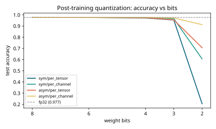
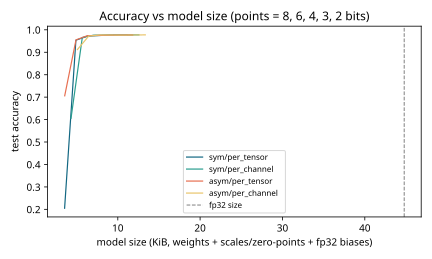
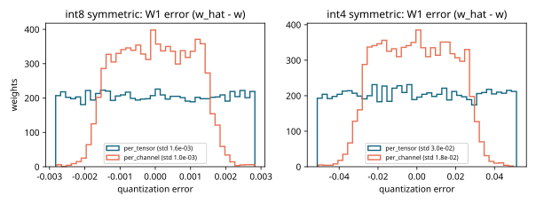

# Results -- ai-learn-21-quantization-scratch

**Seed:** `42` | MLP 20->128->64->8 (11464 params) | train n=6000 | test n=3000 | fp32 test acc **0.9770**, size 45856 B

Weight-only post-training quantization (biases and activations stay fp32).

## Accuracy by bits and scheme

| bits | sym/per_tensor | sym/per_channel | asym/per_tensor | asym/per_channel |
|---:|---:|---:|---:|---:|
| 8 | 0.9777 | 0.9773 | 0.9770 | 0.9773 |
| 6 | 0.9770 | 0.9770 | 0.9760 | 0.9767 |
| 4 | 0.9717 | 0.9763 | 0.9737 | 0.9770 |
| 3 | 0.9540 | 0.9660 | 0.9553 | 0.9723 |
| 2 | 0.2050 | 0.6057 | 0.7060 | 0.9120 |

## Size and weight MSE (symmetric per-tensor vs asymmetric per-channel)

| bits | size sym/per_tensor (B) | ratio vs fp32 | MSE sym/per_tensor | size asym/per_channel (B) | MSE asym/per_channel |
|---:|---:|---:|---:|---:|---:|
| 8 | 12076 | 0.263 | 3.73e-06 | 13664 | 1.25e-06 |
| 6 | 9260 | 0.202 | 6.21e-05 | 10848 | 2.00e-05 |
| 4 | 6444 | 0.141 | 1.22e-03 | 8032 | 3.58e-04 |
| 3 | 5036 | 0.110 | 6.51e-03 | 6624 | 1.66e-03 |
| 2 | 3628 | 0.079 | 3.94e-02 | 5216 | 8.83e-03 |

## Outlier channel test (hidden unit 0 scaled x8, next layer /8)

The rescale is function-preserving (fp32 acc after rescale: 0.9770), but one big column stretches the per-tensor range.

| bits | sym/per_tensor | sym/per_channel | asym/per_tensor | asym/per_channel |
|---:|---:|---:|---:|---:|
| 8 | 0.9773 | 0.9773 | 0.9777 | 0.9773 |
| 4 | 0.9313 | 0.9750 | 0.9413 | 0.9767 |

## Takeaways

- int8 is effectively lossless here (0.9777 vs fp32 0.9770) at 26.3% of the fp32 size.
- int4 costs little: 0.9717 per-tensor, 0.9763 per-channel, at 14.1% of the size.
- At 2 bits symmetric per-tensor collapses to 0.2050; asymmetric per-channel still reaches 0.9120.
- With an outlier channel, int4 per-tensor drops to 0.9313 while per-channel keeps 0.9750. This is why real LLM quantizers use per-channel or per-group scales.

## Plots

Wall time: 1.00s on CPU.
